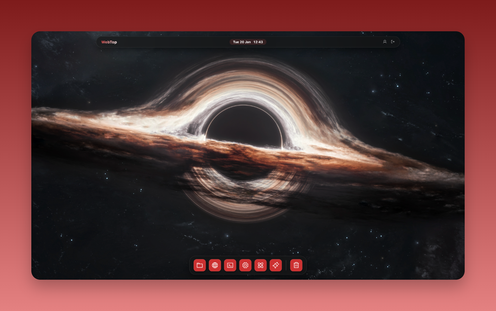
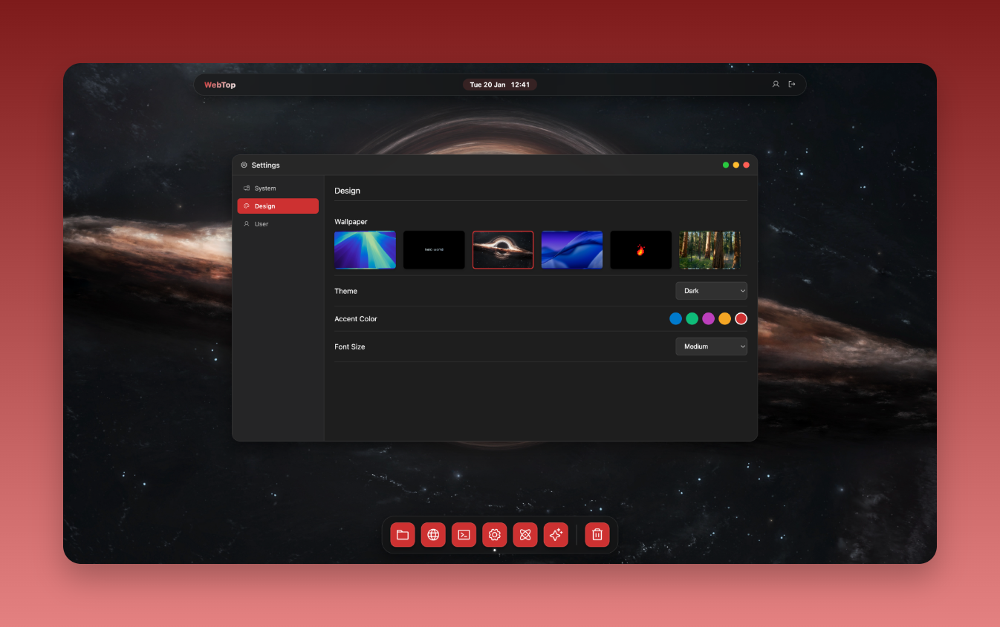

<div align="center">

<pre>
&#8203;
&#8203;
                █▄    █▄            
                ██   ▄██▄           
▀█▄ █▄ ██▀▄█▀█▄ ████▄ ██ ▄███▄ ████▄
 ██▄██▄██ ██▄█▀ ██ ██ ██ ██ ██ ██ ██
  ▀██▀██▀▄▀█▄▄▄▄████▀▄██▄▀███▀▄████▀
                               ██   
                               ▀    
&#8203;
</pre>

[](LICENSE)
[]()
[](https://bun.sh)
[](CLA.md)

</div>

### Code from anywhere. On any device.

I've always dreamed of building my own Operating System—one that breaks the barriers of hardware. I wanted a workspace that I could access from my smartphone, a Meta Quest headset, a random laptop, or anywhere else in the world, just to write code. 

**That's why I built webtop.**

It is a lightweight, web-based desktop environment designed to be the ultimate portable coding station.



⚠️ **Disclaimer:** This project is currently in **super early alpha**. It is **not production-ready**. I am a solo open-source developer building this piece by piece, adding the tools and features I personally need to code effectively.

---

### 🌟 Features

Here is what works right now:

*   **Window Manager:** A full desktop experience with draggable, resizable, and stackable windows. Includes a Dock, Taskbar, and "Immersive Mode".
*   **Session Persistence:** Close the tab, switch browsers, or log in from a different device—your windows and open files reappear exactly how you left them.
*   **Terminal:** A fully functional, low-latency terminal (zsh/bash) powered by `xterm.js` and Bun. Supports resizing and running interactive CLI tools.
*   **File System (Finder):** Navigate your server's files. Create, delete, rename, move, and copy/paste files and folders. Includes Drag & Drop support and a working Trash bin.
    
    

*   **Code Editor:** A lightweight editor with syntax highlighting, project tree view, tabs, and a "scratchpad" mode for quick notes.
*   **Claude Code Integration:** Deep integration with Anthropic's Claude for AI-assisted coding directly within the environment.
*   **Browser:** An internal browser for previewing local apps or browsing the web (via proxy).
*   **Customization:** Dark/Light modes, custom wallpapers, and accent colors.

    

---

### ⚖️ License & Contributions

This project is source-available under the **Business Source License 1.1 (BSL)**.

*   **Commercial Use:** Requires a separate commercial license.
*   **Open Source:** After 4 years, the code converts to Apache 2.0.
*   **Contributions:** Contributions are welcome and accepted under our [Contributor License Agreement (CLA)](CLA.md).

See [LICENSE](LICENSE) for details.

---

### 🛠️ The Tech Stack

I kept it raw and fast. No heavy frontend frameworks.

*   **Backend:** [Bun](https://bun.sh) + [ElysiaJS](https://elysiajs.com). Extremely fast, low overhead.
*   **Database:** SQLite with [Drizzle ORM](https://orm.drizzle.team).
*   **Frontend:** Pure Vanilla JavaScript (ES Modules), CSS Variables, and HTML. Modularized for clean maintenance.
*   **Communication:** WebSockets for real-time Terminal and AI streams.

---

### 🚀 Getting Started

#### Quick Start (Docker Hub)

```bash
docker run -d \
  --name webtop \
  -p 3000:3000 \
  -v webtop-data:/app/data \
  peanuz/webtop:alpha
```

Open `http://localhost:3000` in your browser.

On first launch, you'll be prompted to create your admin account.

#### Docker Compose

Create a `docker-compose.yml`:

```yaml
services:
  webtop:
    image: peanuz/webtop:alpha
    container_name: webtop
    restart: unless-stopped
    ports:
      - "3000:3000"
    volumes:
      - webtop-data:/app/data
    environment:
      - JWT_SECRET=your-secret-min-32-chars

volumes:
  webtop-data:
```

Then run:
```bash
docker compose up -d
```

#### Development (from source)

Prerequisites: [Bun](https://bun.sh) installed.

```bash
git clone https://github.com/peanuz/webtop.git
cd webtop/backend
bun install
bun run dev
```

Open `http://localhost:3000` in your browser.

#### Environment Variables

| Variable | Description |
|----------|-------------|
| `JWT_SECRET` | Secret for JWT tokens (min 32 chars, auto-generated if not set) |
| `PORT` | Server port (default: 3000) |
| `ADMIN_USERNAME` | Override admin username (optional, set on first login) |
| `ADMIN_PASSWORD` | Override admin password (optional, set on first login) |
